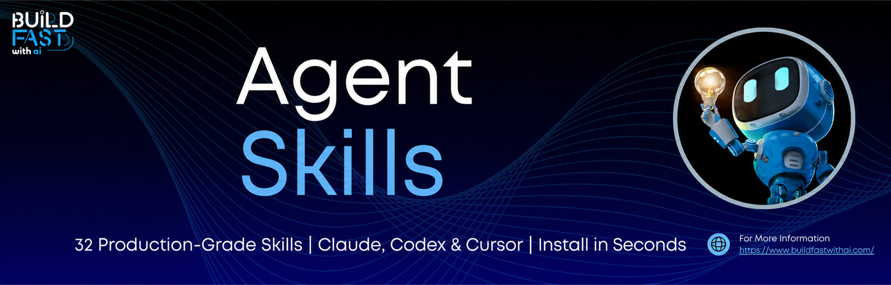

<p align="center">
  <a href="https://www.buildfastwithai.com/">
    
  </a>
</p>

<h1 align="center">✅ Tool Use Validator</h1>

<p align="center"><strong>Validate function-calling payloads against the schema before they execute.</strong></p>

<p align="center">
  
  
  
  <a href="https://github.com/AnshumanSakhare/agent-skills"></a>
</p>

---

> Checks tool-call JSON against a supplied schema before execution — type-safe, no missing required fields, no unexpected extras — so a malformed agent call fails at the boundary instead of halfway through a side effect.

## Install

```bash
npx github:AnshumanSakhare/agent-skills add tool-use-validator-skill
```

<sub>Installs into every agent directory found on your machine. Target one explicitly with `--client claude` &middot; `codex` &middot; `cursor` &middot; `opencode` &middot; `project`, or drop it anywhere with `--dir <path>`.</sub>

## What it does

- Validates against the provided JSON schema strictly
- Catches missing required fields and unexpected extras
- Type-checks values, not just presence
- Explains exactly which path failed and why
- Suggests the corrected payload

## Try it

Once installed, just talk to your agent in plain language:

> *"Validate this tool call against my schema before I run it."*

> *"Why is my function-calling payload being rejected?"*

> *"Add schema validation at my agent's tool boundary."*

## What you get back

- ✅ &nbsp;**Validation verdict**
- ✅ &nbsp;**Path-level error report**
- ✅ &nbsp;**Corrected payload**

## Works with

Claude Code &middot; Claude Desktop &middot; OpenAI Codex &middot; Cursor &middot; opencode &middot; anything that reads the [Agent Skills](https://code.claude.com/docs/en/skills) `SKILL.md` format.

## Tags

`function-calling` &middot; `json-schema` &middot; `validation` &middot; `agents`

---

<p align="center">
  <sub>One of <b>32 skills</b> in <a href="https://github.com/AnshumanSakhare/agent-skills">agent-skills</a>, by <a href="https://www.buildfastwithai.com/">Build Fast with AI</a>.</sub>
</p>

<p align="center">
  <a href="../../README.md">Browse the full catalog</a> &nbsp;·&nbsp; <a href="https://github.com/AnshumanSakhare/agent-skills">⭐ Star the repo</a> &nbsp;·&nbsp; <a href="https://github.com/AnshumanSakhare/agent-skills/blob/main/CONTRIBUTING.md">Add your own skill</a>
</p>
